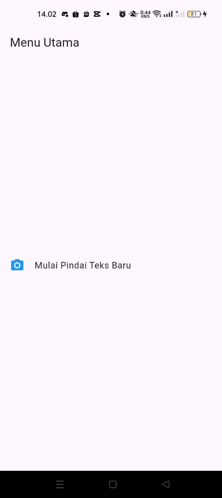
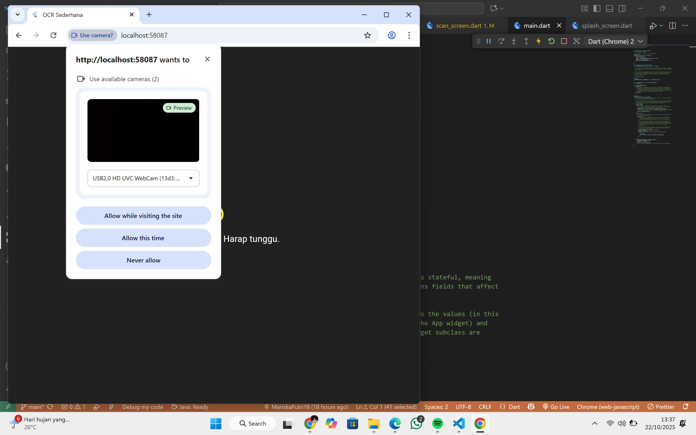
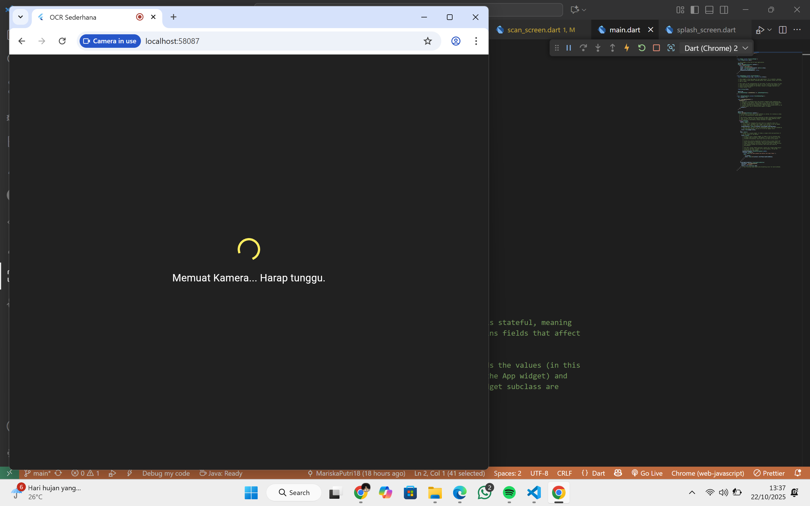
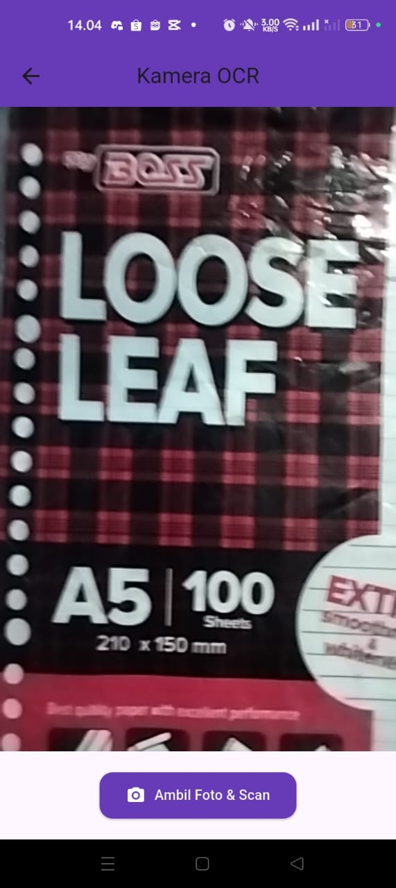
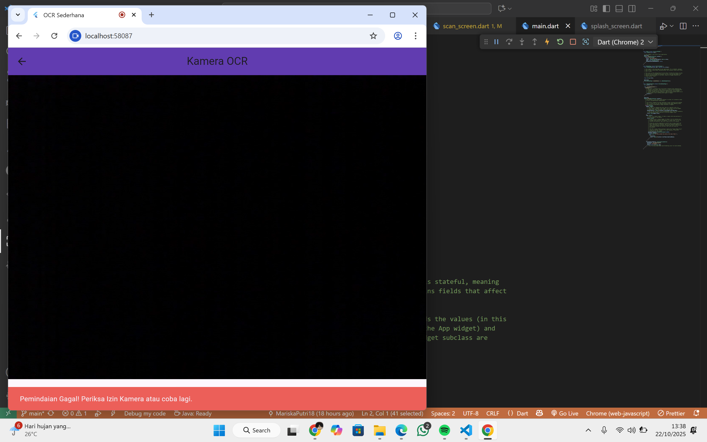

# ocr_sederhana

A new Flutter project.

## PRAKTIKUM 4: Menerapkan Widget Dasar

### LAPORAN 
Untuk dokumentasi dan pembahasan lengkap praktikum ini, terdapat pada link berikut:
https://drive.google.com/file/d/18pvq8DxbQwJJqNIzQCulrvR-jiSPze28/view?usp=drive_link
